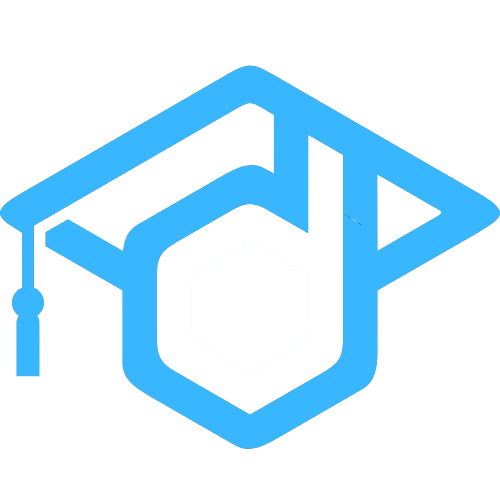
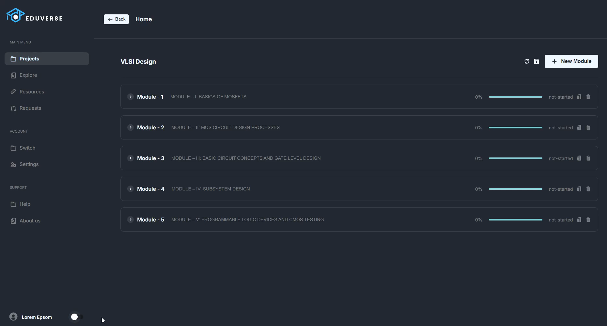
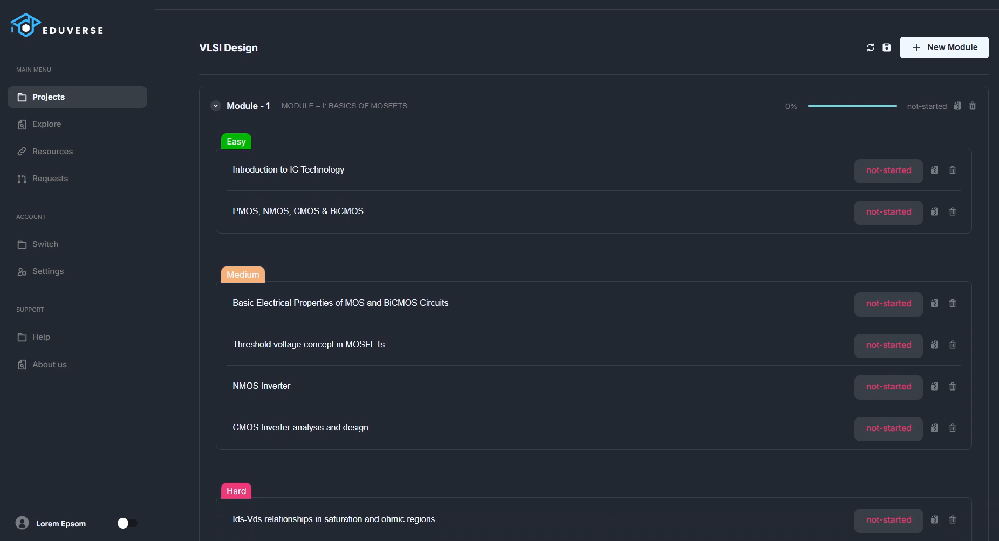

# Eduverse: AI-Powered Study Companion

<p align="center"> </p>

## Table of Contents

1. [Introduction](#introduction)
2. [Problem Statement](#problem-statement)
3. [Features](#features)
4. [How It Works](#how-it-works)
5. [Technology Stack](#technology-stack)
6. [Installation](#installation)
7. [Usage](#usage)
8. [Contributing](#contributing)
9. [License](#license)
10. [Acknowledgments](#acknowledgments)

## Introduction

Eduverse is an innovative desktop application designed to streamline skill acquisition by providing users with personalized, AI-powered learning roadmaps. Whether mastering programming, learning an instrument, or exploring a new language, Eduverse delivers a structured approach to learning through roadmap creation, resource management, and collaboration tools. Built with advanced generative AI, Eduverse simplifies the learning process, empowering users to achieve their goals effectively.

## Problem Statement

Learning a new skill can be overwhelming. Many learners struggle with:

- **Lack of Structure**: Not knowing where to start or how to progress.
- **Resource Overload**: Overwhelming number of resources avaiable online. Difficulty in organizing and managing learning materials.
- **Motivation**: Losing track of progress and feeling demotivated.
- **Collaboration**: Limited ability to share resources or follow others' learning paths.

Eduverse addresses these issues by offering an all-in-one platform that fosters efficient learning through structured roadmaps, intuitive progress tracking, and seamless collaboration and learning path generation powered by generative AI for an optimized user experience.

## Features

### 1. **Create Custom Roadmaps**

- Users can create detailed roadmaps for any skill, breaking it down into modules and topics.
- Example: A roadmap for learning Python could include modules like "Basics," "Data Structures," and "Web Development," with topics like "Variables," "Lists," and "Flask Framework."
- The user can let AI do the roadmap creation if they don't have a fixed path


### 2. **Edit and Update Roadmaps**

- Users can easily modify and update the contents of their roadmaps to reflect their learning progress.
- Example: Add a new topic, reorder modules, or mark a topic as completed.



### 3. **Progress Tracking**

- Track your learning progress and stay motivated.
- Example: Mark topics as "In Progress" or "Completed" and visualize your progress with a progress bar.



### 4. **Resource Management**

- Attach resources (PDFs, videos, links) to specific modules or topics.
- Example: Attach a YouTube tutorial to the "Flask Framework" topic or a PDF eBook to the "Data Structures" module.


### 4. **Automatic Google Drive Integration**

- Add value to other's learning journey by sharing valuable resources.
- Automatic Google Drive upload functionality, which can generate sharable drive links. Which are then accessible to the entire user base.
- Example: Share a resource with a friend by generating a Google Drive link.

  

### 5. **Social Sharing**

- Share your roadmaps and resources with others or follow roadmaps created by other users.
- Example: Follow a roadmap created by an expert in machine learning or share your own roadmap for learning guitar.

### 6. **Internet Resource Recommendations**

- Eduverse can fetch and recommend relevant links from the internet for the user's convenience by scraping the Bing search engine.
- Example: If a user creates a roadmap for "Machine Learning," Eduverse can recommend top-rated courses, tutorials, and articles from the web.

### 7. **AI-Powered Resource Recommendations**

- Eduverse leverages generative AI to recommend the best study resources from the scraped results from web-based on:
  - **Course Requirements**: The AI analyzes the course content and suggests resources that align with the learning objectives.
  - **User's Current Knowledge Level**: The AI assesses your proficiency and recommends resources accordingly.
    - **Beginner**: If you're new to a topic, Eduverse will suggest beginner-friendly guides, introductory videos, and foundational articles.
    - **Intermediate/Advanced**: For experienced learners, it will recommend advanced tutorials, research papers, and tips & tricks to deepen your expertise.


### 8. **Toggle between Light and Dark mode**


## How It Benefits Universities and Learners:

- **For Universities**:
- Provide students with structured, up-to-date curricula tailored to their academic needs.
- Ensure seamless access to high-quality resources for each course.
- Streamline the distribution and updating of educational materials.

- **For Learners**:
- Access personalized resource recommendations aligned with your skill level and learning preferences.
- Stay informed with the most recent materials for your selected skill or course.
- Enhance collaboration by sharing and utilizing resources within a peer network effortlessly.

## How It Works

### 1. **Generative AI for Roadmap Creation**

- Eduverse leverages OpenAI's GPT to dynamically generate learning roadmaps based on the desired skill.
- Example: For "Digital Marketing," the AI creates a roadmap featuring modules like "SEO," "Content Marketing," and "Social Media Advertising," each broken down into relevant topics formatted as a course object.

### 2. **Resource Upload and Sharing**

- Users select the "Share Resource" option, granting the app permission to access their Google Drive.
- Upon consent, access and refresh tokens are securely stored on the user's device.
- Resources are uploaded to Google Drive via its API, and a shareable link is generated and stored in the database for easy retrieval.

### 3. **Progress Tracking**

- Topics can be marked as "Not Started," "In Progress," or "Completed."
- A progress bar visually reflects the learner’s milestones, keeping them motivated and on track.

### 4. **Social Collaboration**

- Browse shared roadmaps, follow those created by others, and access their attached resources.
- Example: A user can follow a roadmap for "Web Development" and access all the resources shared by the creator.

### 5. **Internet Resource Recommendations**

- Eduverse uses web scraping to fetch relevant links from Bing based on the course or skill name.
- Example: For a roadmap on "Data Science," Eduverse can recommend links to freeCodeCamp tutorials, Coursera courses, and Medium articles.
- Recommendations are cached locally to improve performance. Subsequent requests retrieve cached data, ensuring faster response times and efficient use of resources.

### 6. **Curriculum Sharing for Universities**

- Eduverse enables universities and educational institutions to create and share structured learning paths for their curriculum.
- Institutions can attach updated resources, such as lecture notes, research papers, and video tutorials, to each module or topic.
- This feature ensures that students always have access to the latest and most relevant materials and learning paths.

## Technology Stack

![Electron] ![HTML] ![CSS] ![React.js] ![Express.js] ![MongoDB] ![Mongoose ODM] ![git] ![ChatGPT] ![SpringBoot]

### Frontend

- A desktop application built using **[Electron](https://www.electronjs.org/)** and **[React](https://reactjs.org/)** to rovide a rich, desktop-native user interface.

### Backend

- Centralized Roadmap and Resource sharing API built using **[Express](https://expressjs.com/)**, which can handle all API requests and serve data efficiently.

### Database

- **[MongoDB Atlas](https://www.mongodb.com/products/platform/atlas-database)** stores user data, roadmaps, and resources in a highly flexible and scalable schema using **[Mongoose ODM](https://mongoosejs.com/)** as the document mapping library.

<!-- ### Authentication

- **Google OAuth**: For secure user authentication and Google Drive integration. -->

### File Storage

- **[Google Drive API](https://console.cloud.google.com/marketplace/product/google/drive.googleapis.com)**: For uploading resources and generating sharable links.

### Generative AI

- **OpenAI GPT**: For generating roadmap suggestions and content.

### Web Scraping

- **Pupeteer**: For scraping and fetching relevant links from the internet.

## Usage

### 1. **Creating a Roadmap**

- Open the Eduverse app.
- Click on "Create New Roadmap."
- Enter the skill name, and description, and add modules/topics.
- Attach resources to specific topics if needed.
- Save the roadmap.

### 2. **Editing a Roadmap**

- Select the roadmap you want to edit.
- Modify the modules, topics, or resources as needed.
- Save your changes.

### 3. **Sharing Resources**

- Attach a resource to a topic.
- Click on "Share Resource."
- The resource will be uploaded to Google Drive, and a shareable link will be generated and stored.

### 4. **Following a Roadmap**

- Browse shared roadmaps.
- Click on "Follow" to add the roadmap to your list.
- Track your progress and access shared resources.

### 5. **Fetching Internet Recommendations**

- While creating or editing a roadmap, click on "Fetch Recommendations."
- Eduverse will scrape Bing for relevant links and display them for you to add to your roadmap.


https://github.com/user-attachments/assets/4ca401f5-09bf-4805-be32-12b0c98e5c06


## Installation

To run the code on your local machine (for developers or contributors)

### Prerequisites

- Node.js and npm installed
- MongoDB Atlas account
- Google Cloud Platform account with Google Drive API enabled
- OpenAI API key

### Steps

1. **Clone the Repository**

   ```bash
   git clone https://github.com/Mohit-Harsh/StudentPortal.git
   cd "Electron App"

   ```

2. **Install Dependencies**

   ```bash
   # Install electron app's dependencies
   npm install
   ```

3. **Set Up Environment Variables**

   Create a `.env` file in the root directory with the following variables:

   ```env
   MONGO_URI=your_mongodb_atlas_connection_string
   GOOGLE_CLIENT_ID=your_google_client_id
   GOOGLE_CLIENT_SECRET=your_google_client_secret
   OPENAI_API_KEY=your_openai_api_key
   ```

4. **Run the Application**

   ```bash
   # Start the Electron app
   npm run start
   ```

## Contributing

We welcome contributions from the community! If you'd like to contribute to Eduverse, please follow these steps:

1. Fork the repository.
2. Create a new branch for your feature or bug fix.
3. Commit your changes.
4. Push your branch to your fork.
5. Submit a pull request with a detailed description of your changes.

## License

Eduverse is licensed under the MIT License. See the [LICENSE](LICENSE) file for more details.

---

Thank you for checking out Eduverse! We hope this tool helps you on your learning journey 🚀

[Electron]: https://img.shields.io/badge/Electron-20232A?style=for-the-badge&logo=electron&logoColor=61DAFB
[HTML]: https://img.shields.io/badge/HTML-grey?style=for-the-badge&logo=html5
[CSS]: https://img.shields.io/badge/CSS-blue?style=for-the-badge&logo=css3
[React.js]: https://img.shields.io/badge/React-20232A?style=for-the-badge&logo=react&logoColor=61DAFB
[Express.js]: https://img.shields.io/badge/Express.js-yellowgreen?style=for-the-badge&logo=express
[git]: https://img.shields.io/badge/Git-262626?style=for-the-badge&logo=git
[MongoDB]: https://img.shields.io/badge/MongoDB-green?style=for-the-badge&logo=mongodb
[Mongoose ODM]: https://img.shields.io/badge/Mongoose-red?style=for-the-badge&logo=mongoose
[ChatGPT]: https://img.shields.io/badge/ChatGPT-74aa9c?style=for-the-badge&logo=openai&logoColor=white
[SpringBoot]: https://img.shields.io/badge/SpringBoot-black?style=for-the-badge&logo=springboot&logoColor=green
